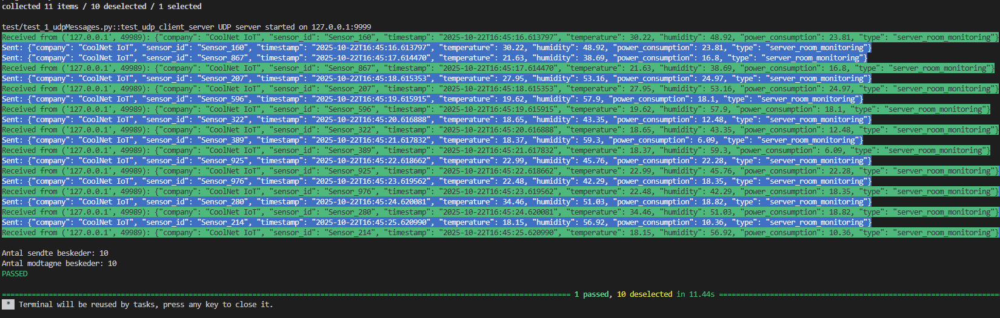

CTO

#
    Hvorfor 
    Formålet med vores virksomhed er at hjælpe virksomheder med at reducere energiforbrug og driftsomkostninger i deres serverrum og datacentre. Overophedning og ineffektiv køling fører ofte til nedbrud og spild af strøm.

    Hvordan
    Vi udvikler IoT-enheder, der måler temperatur, luftfugtighed og strømforbrug i realtid. Data sendes til et centralt system, som sammenligner med forventet temperatur, luftfugtighed og strømforbrug. Hvis værdierne overskrider sikre grænser reguleres kølesystemet yderligere samt server performans begrænses og tekniker alarmeres

    Hvad
    Vores virksomhed hedder CoolNet IoT og opererer inden for grøn IT og datacenter-teknologi. Logoet viser en serverrack med et blå-grønt signalikon, som symboliserer kombinationen af køling, energioptimering og netværksforbindelse.
#

  

