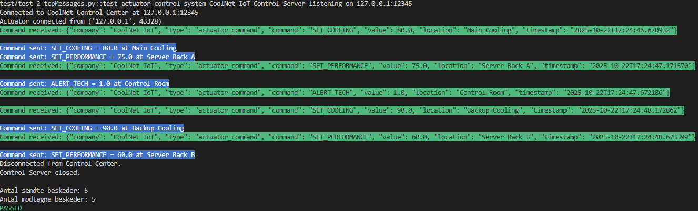
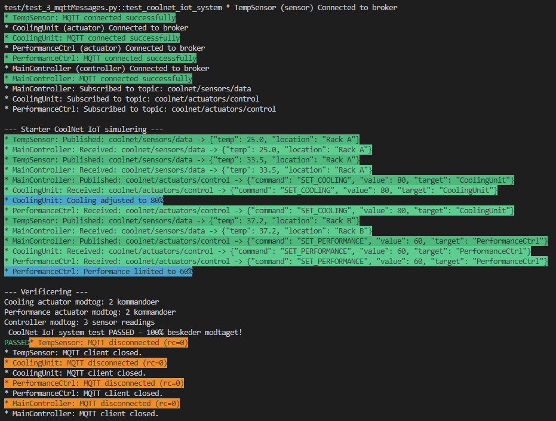
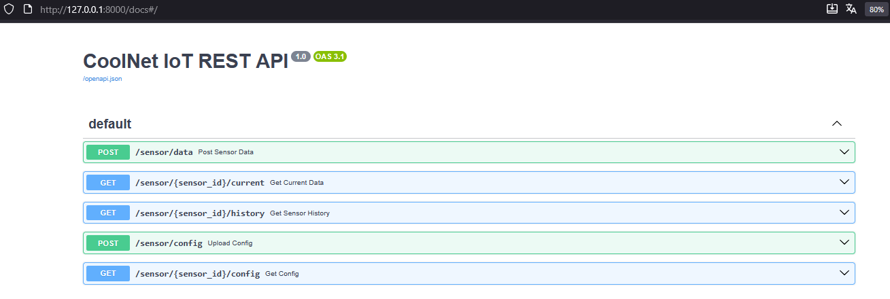
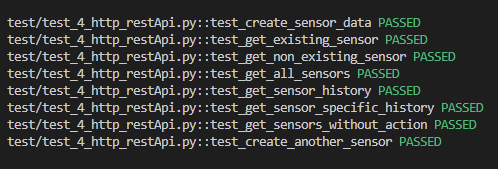
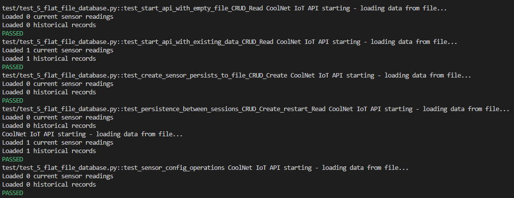

## CoolNet IoT Company
                                      
<p align="center">
  
</p>

## ToC

- [Virksomhedsformål](#virksomhedsformål)
- [Protokol Implementeringer](#-protokol-implementeringer)
  - [UDP - Sensor Data Transmission](#udp---sensor-data-transmission)
  - [TCP - Aktuator Control](#tcp---aktuator-control)
  - [MQTT - IoT Device Kommunikation](#mqtt---iot-device-kommunikation)
- [REST API](#-rest-api)
- [Fysiske Forbindelser](#-fysiske-forbindelser)
- [Data Persistence & OOP](#-data-persistence--oop)
- [System Arkitektur](#-system-arkitektur)
- [Test Strategier](#-test-strategier)


#
Zealand Business Academy (zealand.dk)
   -  Hvorfor:
    Formålet med vores virksomhed er at hjælpe virksomheder med at reducere energiforbrug og driftsomkostninger i deres serverrum og datacentre. Overophedning og ineffektiv køling fører ofte til nedbrud og spild af strøm.

   -  Hvordan:
    Vi udvikler IoT-enheder, der måler temperatur, luftfugtighed og strømforbrug i realtid. Data sendes til et centralt system, som sammenligner med forventet temperatur, luftfugtighed og strømforbrug. Hvis værdierne overskrider sikre grænser reguleres kølesystemet yderligere samt server performans begrænses og tekniker alarmeres

   -  Hvad:
    Vores virksomhed hedder CoolNet IoT og opererer inden for grøn IT og datacenter-teknologi. Logoet viser en serverrack med et blå-grønt signalikon, som symboliserer kombinationen af køling, energioptimering og netværksforbindelse.
#

### UDP

```json
{
  "company": "CoolNet IoT",
  "sensor_id": "Sensor_807",
  "timestamp": "2025-10-22T16:43:14.855655",
  "temperature": 26.4,
  "humidity": 36.88,
  "power_consumption": 24.35,
  "type": "server_room_monitoring"
}
```

Vi bruger UDP til at sende sensordata fra vores IoT-enheder i serverrum til vores overvågningssystem.

Hvorfor UDP passer perfekt til os:

- Hastighed over perfekt pålidelighed: Det er vigtigere at få den seneste temperaturmåling (f.eks. 35°C) end at vente på en gammel, tabt pakke (f.eks. 32°C)

- Realtids respons: Vores system skal kunne reagere med det samme ved overophedning - ikke vente på pakkeretransmission

- Tæt datastream: Sensorerne sender data hvert sekund, så et enkelt tabt datapunkt erstattes hurtigt af den næste måling

- Lav overhead: Simpel protokol der passer til vens enkle IoT-enheder

For at demonstrere systemets robusthed testede vi med Clumsy network emulator sat til 10% pakketab. Som stadig modtager over **80% af beskederne** selv under netværksforstyrrelser
#


### TCP til Aktuatorstyring

Vi bruger TCP til kontrol af aktuatorer fordi:

- **100% pålidelighed** er kritisk når vi styrer kølesystemer og serverperformance
- **Kontrolkommandoer** skal eksekveres præcis én gang - ikke mistes eller duplikeres  
- **Fejlsikring** ved netværksproblemer er afgørende for systemstabilitet

### Aktuatorkommandoer:
- `SET_COOLING` - Justerer kølesystemets effekt
- `SET_PERFORMANCE` - Begrænser server performance ved overophedning
- `ALERT_TECH` - Alarmerer tekniker ved kritiske situationer



```json
"SET_COOLING = 80.0 at Main Cooling"
{
  "company": "CoolNet IoT",
  "type": "actuator_command",
  "command": "SET_COOLING",
  "value": 80,
  "location": "Main Cooling",
  "timestamp": "2025-10-22T17:24:46.670932"
}
```

For at demonstrere systemets robusthed og at TCP leverer **100% af beskederne** testede vi med Clumsy network emulator sat til 10% pakketab.
 
#


### MQTT

### Formål
Vi bruger MQTT til kommunikation mellem vores IoT-enheder i CoolNet IoT systemet:
- **Sensorer** måler temperatur og andre parametre i serverrum
- **Aktuatorer** styrer kølesystemer og serverperformance  
- **Controller** koordinerer kommunikationen mellem enheder

### Valg af MQTT
MQTT er et godt valg til vores IoT-system af følgende årsager:

- **Pub/Sub arkitektur**: Sensorer publiserer data, controller subscriber og sender kommandoer til aktuatorer
- **Lavt strømforbrug**: Ideelt til embedded IoT-enheder med begrænset strøm
- **Fleksibel topologi**: Let at tilføje nye sensorer og aktuatorer uden at ændre hele systemet
- **QoS garantier**: Kan sikre 100% levering af kritiske kontrolkommandoer
- **Lav latency**: Hurtig kommunikation mellem enheder er afgørende for realtids kontrol

### System Arkitektur
- **Sensorer** → Publisher på `coolnet/sensors/data`
- **Controller** → Subscriber på sensor data + Publisher på kontrolkommandoer
- **Aktuatorer** → Subscriber på `coolnet/actuators/control`

### Test med Clumsy
Vores MQTT-system med QoS niveau 1 leverer **100% af beskederne** selv når Clumsy er sat til 10% pakketab, hvilket demonstrerer systemets robusthed.




### Systemarkitektur

[ Sensorer ] - [ MQTT Broker ] - [ Controller ] - [ Aktuatorer ]

- Sensorer: temperatur, luftfugtighed, strømforbrug
- Controller: central logik i Python
- Aktuatorer: blæser, køleenhed, server-throttle, alarm

#


### Fysiske Forbindelser

### Valg af Fysiske Forbindelser

I CoolNet IoT systemet bruger vi en kombination af fysiske forbindelser afhængigt af enhedernes placering og behov:

#### 1. **Ethernet (Kablet Forbindelse)**
- **Anvendelse**: Primær forbindelse til serverrummets centrale enheder
- **Hvorfor**: 
  - Høj pålidelighed og bandwidth
  - Lav latency for realtids kontrol
  - God elektromagnetisk kompatibilitet i miljøer med meget elektronik
  - Sikkerhed - fysisk adgangskontrol til netværk

#### 2. **Wi-Fi (Trådløs)**
- **Anvendelse**: Sensorer og aktuatorer hvor kabler er upraktiske
- **Hvorfor**:
  - Fleksibel installation - ingen kabeltrækning nødvendig
  - Let at tilføje nye enheder
  - God dækning i store serverrum og datacentre
  - Understøtter roaming mellem access points

#


### REST API 



### API Response Eksempler
```json
{
  "status": "ok",
  "data": {
    "sensor_001": {
      "sensor_id": "sensor_001",
      "temperature": 28.5,
      "humidity": 45.2,
      "power_consumption": 15.7,
      "location": "Server Rack A",
      "timestamp": "2025-10-22T20:15:47.667123",
      "company": "CoolNet IoT"
    }
  }
}
```




## Data Persistence og OOP Arkitektur

### Hvorfor gemme og loade data?
- **Data Sikkerhed**: Sikrer at sensordata ikke går tabt ved genstart
- **System Robusthed**: Kan genstartes uden data-tab
- **Historisk Analyse**: Muliggør langtidsanalyse af trends
- **Disaster Recovery**: Data kan gendannes ved systemfejl

### Fordele ved OOP og Class Opdeling
- **Separation of Concerns**: Hver klasse har et specifikt ansvar
- **Genbrugelighed**: `FlatFileLoader` kan bruges til andre projekter
- **Testbarhed**: Enkelte komponenter kan testes isoleret
- **Vedligeholdelse**: Lettere at rette fejl og tilføje features
- **Skalerbarhed**: Let at udvide med nye data kilder (SQL, NoSQL)

### Arkitektur
- `CoolNetRestAPI` - Hoved API logik og endpoint management
- `FlatFileLoader` - Data persistence lag (gem/load JSON)
- `SensorData` - Data model validering med Pydantic
- `SensorConfig` - Konfigurations model

### Test Coverage
-  Empty file initialization
-  Existing data loading  
-  Data persistence verification
-  Cross-session data availability
-  Error handling (404, 400)
-  Configuration management

*Unit-test*


