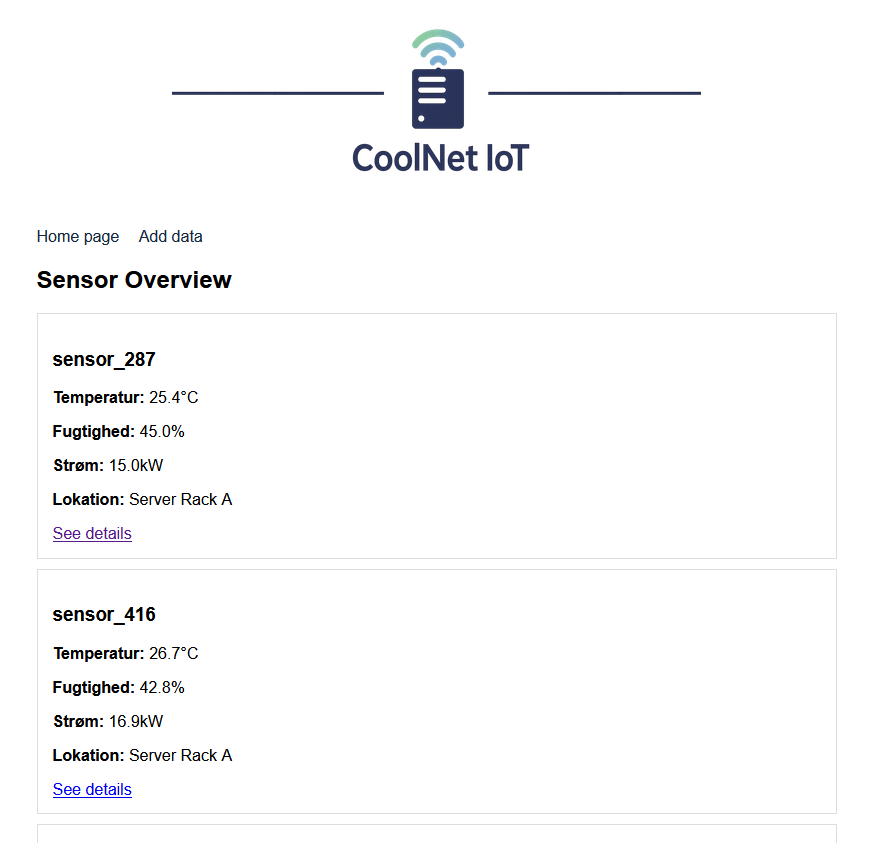
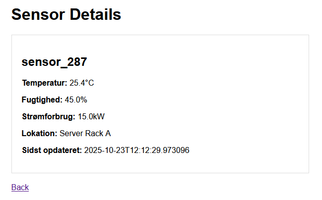
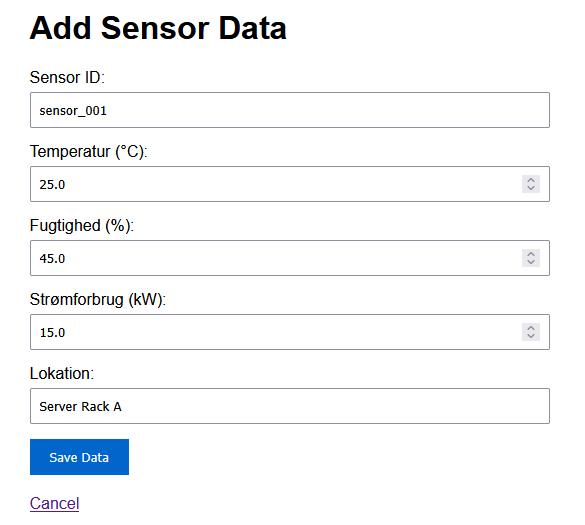
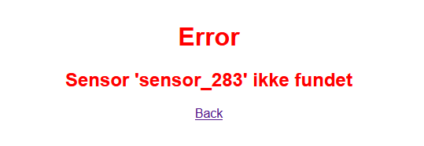
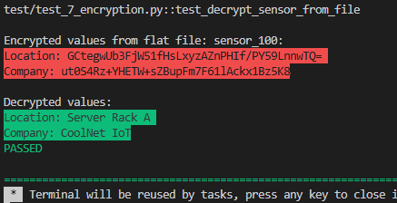

## CoolNet IoT Company
                                      
<p align="center">
  
</p>

## ToC

- [Virksomhedsformål](#virksomhedsformål)
- [UDP - Sensor Data Transmission](#UDP---SENSOR-DATA-TRANSMISSION)
- [TCP - Aktuator Control](#TCP-til-Aktuatorstyring)
- [MQTT - IoT Device Kommunikation](#MQTT)
- [REST API](#REST-API)
- [Fysiske Forbindelser](#Fysiske-forbindelser)
- [Data Persistence & OOP](#Data-Persistence-og-OOP-Arkitektur)
- [System Arkitektur](#-system-arkitektur)
- [Frontend](#Frontend-Implementering)
- [Encryption](#Encryption)


#
Zealand Business Academy (zealand.dk)
   -  Hvorfor:
    Formålet med vores virksomhed er at hjælpe virksomheder med at reducere energiforbrug og driftsomkostninger i deres serverrum og datacentre. Overophedning og ineffektiv køling fører ofte til nedbrud og spild af strøm.

   -  Hvordan:
    Vi udvikler IoT-enheder, der måler temperatur, luftfugtighed og strømforbrug i realtid. Data sendes til et centralt system, som sammenligner med forventet temperatur, luftfugtighed og strømforbrug. Hvis værdierne overskrider sikre grænser reguleres kølesystemet yderligere samt server performans begrænses og tekniker alarmeres

   -  Hvad:
    Vores virksomhed hedder CoolNet IoT og opererer inden for grøn IT og datacenter-teknologi. Logoet viser en serverrack med et blå-grønt signalikon, som symboliserer kombinationen af køling, energioptimering og netværksforbindelse.
#

### UDP - SENSOR DATA TRANSMISSION

```json
{
  "company": "CoolNet IoT",
  "sensor_id": "Sensor_807",
  "timestamp": "2025-10-22T16:43:14.855655",
  "temperature": 26.4,
  "humidity": 36.88,
  "power_consumption": 24.35,
  "type": "server_room_monitoring"
}
```

Vi bruger UDP til at sende sensordata fra vores IoT-enheder i serverrum til vores overvågningssystem.

Hvorfor UDP passer perfekt til os:

- Hastighed over perfekt pålidelighed: Det er vigtigere at få den seneste temperaturmåling (f.eks. 35°C) end at vente på en gammel, tabt pakke (f.eks. 32°C)

- Realtids respons: Vores system skal kunne reagere med det samme ved overophedning - ikke vente på pakkeretransmission

- Tæt datastream: Sensorerne sender data hvert sekund, så et enkelt tabt datapunkt erstattes hurtigt af den næste måling

- Lav overhead: Simpel protokol der passer til vens enkle IoT-enheder

For at demonstrere systemets robusthed testede vi med Clumsy network emulator sat til 10% pakketab. Som stadig modtager over **80% af beskederne** selv under netværksforstyrrelser
#


### TCP til Aktuatorstyring

Vi bruger TCP til kontrol af aktuatorer fordi:

- **100% pålidelighed** er kritisk når vi styrer kølesystemer og serverperformance
- **Kontrolkommandoer** skal eksekveres præcis én gang - ikke mistes eller duplikeres  
- **Fejlsikring** ved netværksproblemer er afgørende for systemstabilitet

### Aktuatorkommandoer:
- `SET_COOLING` - Justerer kølesystemets effekt
- `SET_PERFORMANCE` - Begrænser server performance ved overophedning
- `ALERT_TECH` - Alarmerer tekniker ved kritiske situationer


```json
"SET_COOLING = 80.0 at Main Cooling"
{
  "company": "CoolNet IoT",
  "type": "actuator_command",
  "command": "SET_COOLING",
  "value": 80,
  "location": "Main Cooling",
  "timestamp": "2025-10-22T17:24:46.670932"
}
```

For at demonstrere systemets robusthed og at TCP leverer **100% af beskederne** testede vi med Clumsy network emulator sat til 10% pakketab.
 
#


### MQTT

### Formål
Vi bruger MQTT til kommunikation mellem vores IoT-enheder i CoolNet IoT systemet:
- **Sensorer** måler temperatur og andre parametre i serverrum
- **Aktuatorer** styrer kølesystemer og serverperformance  
- **Controller** koordinerer kommunikationen mellem enheder

### Valg af MQTT
MQTT er et godt valg til vores IoT-system af følgende årsager:

- **Pub/Sub arkitektur**: Sensorer publiserer data, controller subscriber og sender kommandoer til aktuatorer
- **Lavt strømforbrug**: Ideelt til embedded IoT-enheder med begrænset strøm
- **Fleksibel topologi**: Let at tilføje nye sensorer og aktuatorer uden at ændre hele systemet
- **QoS garantier**: Kan sikre 100% levering af kritiske kontrolkommandoer
- **Lav latency**: Hurtig kommunikation mellem enheder er afgørende for realtids kontrol

### System Arkitektur
- **Sensorer** → Publisher på `coolnet/sensors/data`
- **Controller** → Subscriber på sensor data + Publisher på kontrolkommandoer
- **Aktuatorer** → Subscriber på `coolnet/actuators/control`

### Test med Clumsy
Vores MQTT-system med QoS niveau 1 leverer **100% af beskederne** selv når Clumsy er sat til 10% pakketab, hvilket demonstrerer systemets robusthed.


### Systemarkitektur

[ Sensorer ] - [ MQTT Broker ] - [ Controller ] - [ Aktuatorer ]

- Sensorer: temperatur, luftfugtighed, strømforbrug
- Controller: central logik i Python
- Aktuatorer: blæser, køleenhed, server-throttle, alarm

#


### Fysiske Forbindelser

### Valg af Fysiske Forbindelser

I CoolNet IoT systemet bruger vi en kombination af fysiske forbindelser afhængigt af enhedernes placering og behov:

#### 1. **Ethernet (Kablet Forbindelse)**
- **Anvendelse**: Primær forbindelse til serverrummets centrale enheder
- **Hvorfor**: 
  - Høj pålidelighed og bandwidth
  - Lav latency for realtids kontrol
  - God elektromagnetisk kompatibilitet i miljøer med meget elektronik
  - Sikkerhed - fysisk adgangskontrol til netværk

#### 2. **Wi-Fi (Trådløs)**
- **Anvendelse**: Sensorer og aktuatorer hvor kabler er upraktiske
- **Hvorfor**:
  - Fleksibel installation - ingen kabeltrækning nødvendig
  - Let at tilføje nye enheder
  - God dækning i store serverrum og datacentre
  - Understøtter roaming mellem access points

#


### REST API 


### API Response Eksempler
```json
{
  "status": "ok",
  "data": {
    "sensor_001": {
      "sensor_id": "sensor_001",
      "temperature": 28.5,
      "humidity": 45.2,
      "power_consumption": 15.7,
      "location": "Server Rack A",
      "timestamp": "2025-10-22T20:15:47.667123",
      "company": "CoolNet IoT"
    }
  }
}
```


## Data Persistence og OOP Arkitektur

### Hvorfor gemme og loade data?
- **Data Sikkerhed**: Sikrer at sensordata ikke går tabt ved genstart
- **System Robusthed**: Kan genstartes uden data-tab
- **Historisk Analyse**: Muliggør langtidsanalyse af trends
- **Disaster Recovery**: Data kan gendannes ved systemfejl

### Fordele ved OOP og Class Opdeling
- **Separation of Concerns**: Hver klasse har et specifikt ansvar
- **Genbrugelighed**: `FlatFileLoader` kan bruges til andre projekter
- **Testbarhed**: Enkelte komponenter kan testes isoleret
- **Vedligeholdelse**: Lettere at rette fejl og tilføje features
- **Skalerbarhed**: Let at udvide med nye data kilder (SQL, NoSQL)

### Arkitektur
- `CoolNetRestAPI` - Hoved API logik og endpoint management
- `FlatFileLoader` - Data persistence lag (gem/load JSON)
- `SensorData` - Data model validering med Pydantic
- `SensorConfig` - Konfigurations model

### Test Coverage
-  Empty file initialization
-  Existing data loading  
-  Data persistence verification
-  Cross-session data availability
-  Error handling (404, 400)
-  Configuration management

*Unit-test*


# Frontend Implementering

## Problemstilling
Brugere havde kun adgang til systemet via API-kald og terminal, hvilket gjorde det svært for ikke-tekniske medarbejdere at overvåge data og udføre daglige opgaver. Manglen på visuel grænseflade førte til fejl og ineffektivitet.

## Løsning
Vi har udviklet en webbaseret HTML-frontend der giver et intuitivt og grafisk interface til CoolNet IoT systemet med real-time visning af sensordata.

## Screenshots

### Forside - Dashboard



### Sensor Detaljer - Visning



### Tilføj Data - Formular



### Fejl Visning



## HTML & CSS Templates

### Template Struktur
```html
<!DOCTYPE html>
<html>
<head>
    <title>CoolNet IoT</title>
    <style>
        body { font-family: Arial; max-width: 800px; margin: 0 auto; padding: 20px; }
        .header { 
            background: #15283dff; 
            color: white; 
            padding: 20px; 
            text-align: center; 
        }
        .header img {
            height: 50px;
            width: auto;
            margin-bottom: 10px;
        }
        .sensor { border: 1px solid #ddd; padding: 15px; margin: 10px 0; }
        .critical { border-left: 5px solid red; }
        .warning { border-left: 5px solid orange; }
    </style>
</head>
<body>
    <div class="header">
        
        <h1>CoolNet IoT Dashboard</h1>
        <p>Server Room Monitoring</p>
    </div>
    <!-- Indhold -->
</body>
</html>
```
- Fil struktur
```bash 
  src/http
        ├── http_eksempel_6_frontend/        # Frontend
        │   ├── frontend_api.py              # FastAPI frontend app
        │   ├── main.py                      # Frontend entry point
        │   ├── templates/                   # HTML templates
        │   │   ├── index.html               # Forside/dashboard
        │   │   ├── view.html                # Sensor detaljer
        │   │   ├── add.html                 # Tilføj formular
        │   │   └── error.html               # Fejl visning
        │   └── static/                      # Static files
        │       └── images/
        │           └── coolnetiotlogo3.png  # Company logo
        ├── http_eksempel_4/                 # Backend
        │   ├── coolnet_rest_api.py          # REST API business logic
        │   ├── flat_file_loader.py          # Data persistence
        │   └── main.py                      # Backend entry point
        └── coolnet_sensors.json             # Database (JSON file)
```
- Backend, frontend, database diagram
```bash 
┌─────────────────┐    HTTP/JSON     ┌─────────────────┐    File I/O     ┌─────────────────┐
│    Frontend     │ ←──────────────→ │    Backend      │ ←─────────────→ │   Database      │
│  (FastAPI App)  │                  │  (FastAPI App)  │                 │  (JSON File)    │
│  Port: 8500     │   AJAX Calls     │  Port: 8000     │   Read/Write    │ coolnet_sensors.│
│ HTML/CSS/JS     │                  │ Business Logic  │                 │      json       │
└─────────────────┘                  └─────────────────┘                 └─────────────────┘
      ↑                                     ↑                                     ↓
   Browser                              Data Validation                      Persistent
   Interface                                                                   Storage
```

Fordele ved Opdeling
Frontend 

    Brugergrænseflade - Visuel representation af data

    Interaktivitet - Formularer, navigation, real-time updates

    Tilgængelighed - Tilgængeligt for ikke-tekniske brugere

Backend (Forretningslogik)

    API Management - Håndterer HTTP requests/responses

    Data Validering - Sikrer korrekt dataformat

    Business Rules - Implementerer systemlogik og regler

Database (Datalag)

    Data Persistence - Langtidsobevaring af information

    Data Integrity - Konsistent datastruktur

    Backup - Mulighed for datasikkerhedskopier


## Encryption

**Symmetrisk (AES)**

    Bruges til at kryptere sensor- og aktuator-data i flat_file (Location & company name (Se længere nede)).

    Fordel: Hurtigt og effektivt, da både IoT-enhed og server deler samme nøgle.

    Bruges fx når data lagres midlertidigt i filsystemet.

    Giver både fortrolighed (confidentiality) og integritet (autentitet)

    Info: 
      - Algoritme: AES
      - Mode: EAX (AES.MODE_EAX)
      - Base64 (Krypteret output er binær data. Base64 konverterer det til tekst, så det kan gemmes i JSON)
      - Nøglelængde: 16 bytes (AES-128)


```json
    "sensor_100": {
      "sensor_id": "sensor_100",
      "temperature": 25.0,
      "humidity": 45.0,
      "power_consumption": 17.2,
      "location": "GCtegwUb3FjW51fHsLxyzAZnPHIf/PY59LnnwTQ=",
      "timestamp": "2025-10-28T10:04:02.202421",
      "company": "ut0S4Rz+YHETW+sZBupFm7F61lAckx1Bz5K8"
    }
```





Asymmetrisk (RSA) - Ikke brugt

    Bruges ved kommunikation mellem IoT-enheder og central controller, hvor nøgler skal udveksles sikkert.

    Fx: Controlleren sender sin offentlige nøgle til sensoren → sensoren bruger den til at kryptere AES-nøglen.

Hashing (SHA-256) - Ikke brugt

    Bruges til lagring af brugernavne, adgangskoder og API-nøgler i databasen/flat_file.

    Fordel: Man kan validere login uden at gemme klartekst.